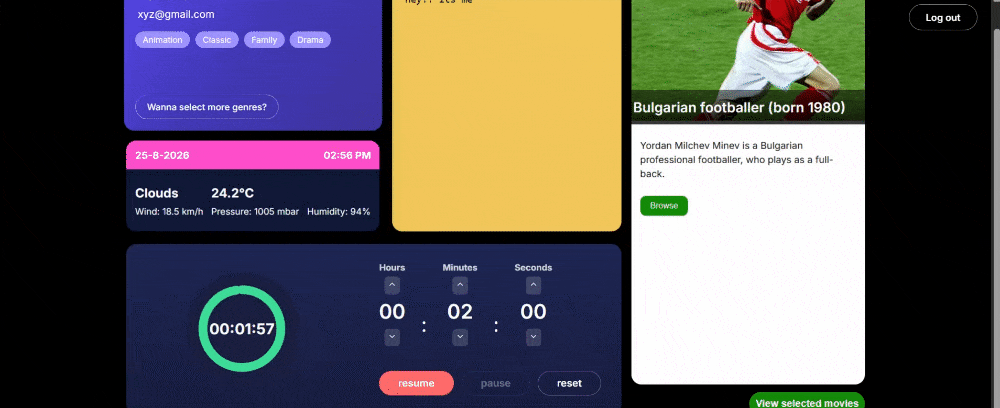
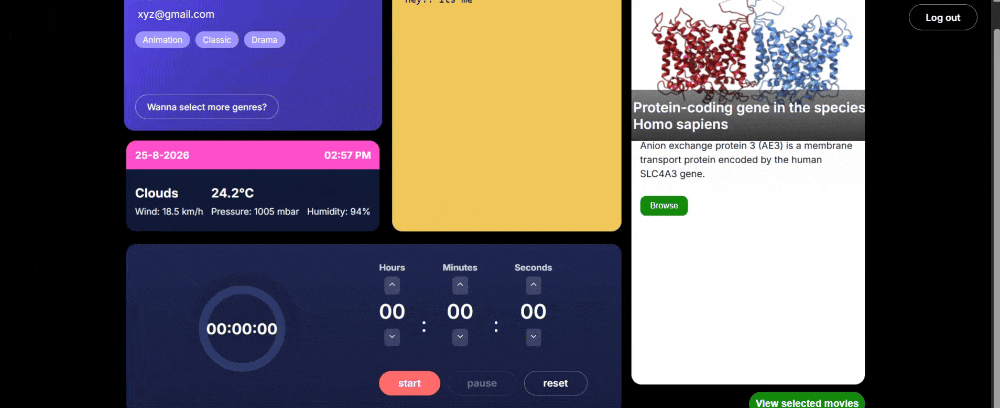

# SuperApp — Personal Dashboard

A multi-widget personal dashboard built in React and TypeScript. Users sign up, pick the film genres they like, and get a dashboard with a movie board tailored to those picks, plus notes, a countdown timer, local weather, and a random Wikipedia article.

**Live demo:** https://phoapp.vercel.app

**Repo:** https://github.com/VidhiDixit2000/superapp-dashboard

### Register, log in, and reach the dashboard


### Timer and genre selection



### Dashboard and movie widget



---

## Why this exists

I built this while brushing up on React. The goal was to put everything into one app rather than another set of isolated exercises — I'd built smaller React projects before, but nothing with authentication, multiple pages, or several data sources at once.

The scope was deliberately front-end only. I've worked with databases, Docker and AWS on other projects, but here I wanted the difficulty to sit in React itself — state, effects, routing, and rendering — rather than in infrastructure.

What I didn't expect was that the hardest problems wouldn't be UI at all. They were about **where state lives and when it's allowed to be stale.** Most of the notes below are about that.

---

## Features

- **Sign up and log in** — multiple accounts, each with fully isolated data
- **Genre selection** — pick at least three categories; selections persist per account
- **Movie board** — posters fetched per genre, with per-genre error handling
- **Notes** — auto-saving, debounced so it writes after you stop typing rather than on every keystroke
- **Countdown timer** — circular SVG progress ring with start, pause, resume and reset
- **Weather** — current conditions from your browser's geolocation
- **Random fact** — a Wikipedia article summary on each load

---

## Tech stack

| | |
|---|---|
| Framework | React + TypeScript |
| Build tool | Vite |
| Routing | React Router v6 |
| State | React Context |
| Persistence | localStorage |
| Utilities | lodash (debounce), react-icons |
| Hosting | Vercel |

**APIs:** [SampleAPIs](https://sampleapis.com) for film posters, [OpenWeather](https://openweathermap.org/api) for current conditions, [Wikipedia REST API](https://en.wikipedia.org/api/rest_v1/) for random article summaries.

---

## Running locally

```bash
git clone https://github.com/VidhiDixit2000/superapp-dashboard.git
cd superapp-dashboard
npm install
```

Copy `.env.example` to `.env` and add your own OpenWeather key (free at [openweathermap.org/api](https://openweathermap.org/api)):

```
VITE_OPENWEATHER_KEY=your_key_here
```

```bash
npm run dev
```

New OpenWeather keys can take up to two hours to activate. If the weather widget shows an error at first, that's usually why.

---

## Data model

Everything lives in `localStorage` under four kinds of key:

```
users                     →  [{ name, email, password }, ...]
currentUserEmail          →  "someone@example.com"
notes_<email>             →  "..."
selectedMovies_<email>    →  ["Comedy", "Horror", ...]
```

`users` is the account list. `currentUserEmail` is a pointer into it. Per-user data is namespaced by email, so accounts can never read or overwrite each other's notes and genre picks.

The important property is that **nothing is stored twice.** The logged-in user's name and email aren't kept anywhere separately — they're looked up from `users` using `currentUserEmail`. That constraint came out of a bug, described below.

---

## Engineering notes

The parts of this project that actually taught me something.

### Two copies of the same fact will eventually disagree

The first version stored the logged-in user in a single key called `userdet`. One slot, overwritten on every signup — so a second account silently clobbered the first, and every new user saw the previous user's data.

Rebuilding it as `users` plus a `currentUserEmail` pointer fixed the overwriting. But the bug survived the fix, because `userdet` was still sitting in localStorage and the profile page was still reading it. For a while the app was in a state where `currentUserEmail` said one account and `userdet` said another, and the UI rendered whichever one it happened to read.

Neither value was wrong on its own terms. They were two copies of the same fact that had drifted apart. The rule I took from it: **store the minimum and derive the rest.** If two pieces of state can ever contradict each other, one of them shouldn't exist.

### Debouncing: useMemo controls creation, not execution

The notes field saves automatically, three seconds after you stop typing. Getting there took three attempts.

`useEffect` with the input value as a dependency runs on every keystroke, which defeats the point of debouncing. Defining the debounced function inline in the component body recreates it on every render, so each keystroke gets a fresh timer that never fires. The distinction that resolved it is that `useMemo` controls *creation* while leaving *execution* to the event handler — unlike `useEffect`, which handles both.

The version in `Notes.tsx` uses `useMemo`, with `saveNotes` wrapped in `useCallback` inside the context so its identity stays stable and the debounce is created once. `useRef` would work equally well and is arguably clearer, since a ref is created once by definition and sidesteps the dependency question entirely.

There was a second bug hiding underneath: the textarea was bound to the saved value, but `onChange` only called the debounced save. So React re-rendered with the old value while the new one sat in a pending timer, and characters disappeared as you typed. Fixed by keeping a local draft for display and letting the debounce handle persistence — display and persistence are different concerns and needed different state.

### Effects run after paint, which is why stale state shows

The movie board fetches posters when the genre list changes, and stores the result in state. Rendering directly from that state means a genre the user just deselected stays on screen until the network requests finish, because effects run *after* the browser has already painted the frame.

The fix isn't to update faster — it's to stop rendering from the value that lags:

```tsx
const visibleGenres = Object.entries(moviesByGenre)
  .filter(([genre]) => selectedMovies.includes(genre));
```

`moviesByGenre` is still stale. It just can't reach the screen, because everything is filtered through `selectedMovies`, which the context updates synchronously. Same principle as the first note: don't render from a source that can disagree with the truth.

### Hardcoded lists drift away from the APIs they describe

The genre buttons and the API endpoints started as two separate lists connected by `.toLowerCase()`. That works for `Comedy → comedy` and fails for `Action → action-adventure`, which isn't a transformation at all — it's a lookup that string manipulation can't invent. Users could pick genres that returned 404, and the failure surfaced two pages later as a blank grid with no error.

Now there's one file, `src/constants/genres.ts`, mapping display label to endpoint slug. The buttons render from its keys and the fetch reads its values, so a genre can only be offered if an endpoint exists for it. The bug became structurally impossible rather than handled after the fact.

### The same import can work locally and fail in CI

The first deploy failed on `Could not resolve "../styles/Randomfacts.css"` — an import that had worked on my machine for months. Windows filesystems are case-insensitive, so `Randomfacts.css` and `randomfacts.css` are the same file locally. Vercel builds on Linux, where they aren't.

A whole class of bugs only appears when the deploy environment differs from the development one, and none of them are visible while you're only running things locally. Worth deploying early for that reason alone.

### Defining async functions inside the effect that uses them

The random-fact widget declared its fetch function in the component body and called it from an effect. That recreates the function on every render while the effect captures only the first one, and it trips the `react-hooks/set-state-in-effect` lint rule. Moving the declaration inside the effect scopes it to the one place it's used and makes the cleanup flag straightforward to add.

---

## Known limitations

**Authentication is mocked.** Accounts are stored in `localStorage` with passwords in plaintext. This is not acceptable in production and isn't intended to be — the goal was to build the client-side auth *flow* (guarded routes, session persistence, per-user data isolation) without a backend. With a server I'd use httpOnly session cookies and hash passwords server-side.

**The API key is exposed at runtime.** The OpenWeather key is read from an environment variable, which keeps it out of the repository, but a client-side app still sends it in a request the user can inspect. The real fix is proxying through a backend route so the key never reaches the browser.

**Per-user isolation is enforced by convention.** Namespaced localStorage keys work, but nothing stops a user opening DevTools and reading another account's data. A real database enforces this at the schema level rather than by naming discipline. Having hand-rolled it, I understand what row-level security is actually for.

**Genre coverage is limited.** SampleAPIs serves nine categories, so no Thriller, Romance, Documentary or Sci-Fi. This was originally built against TMDB, which has all of them — that integration broke when their API changed, and I migrated rather than maintain it. The lesson: components were coupled directly to a third-party response shape, so when the shape moved, the components moved with it. A backend proxy would have contained that change to one file.

**No tests.** The obvious next step, and the honest reason there aren't any is scope.

---

## What I'd do differently

Add a real backend and database. Not because the app needs one to function, but because three of the four limitations above collapse into a single fix — proper auth, server-side API keys, and enforced data isolation all follow from having a server.

The front-end-only scope was the right call for what I was trying to learn. But building the data isolation by hand is what showed me why databases enforce it for you.

---

## Status

Complete and deployed. Not under active development.
